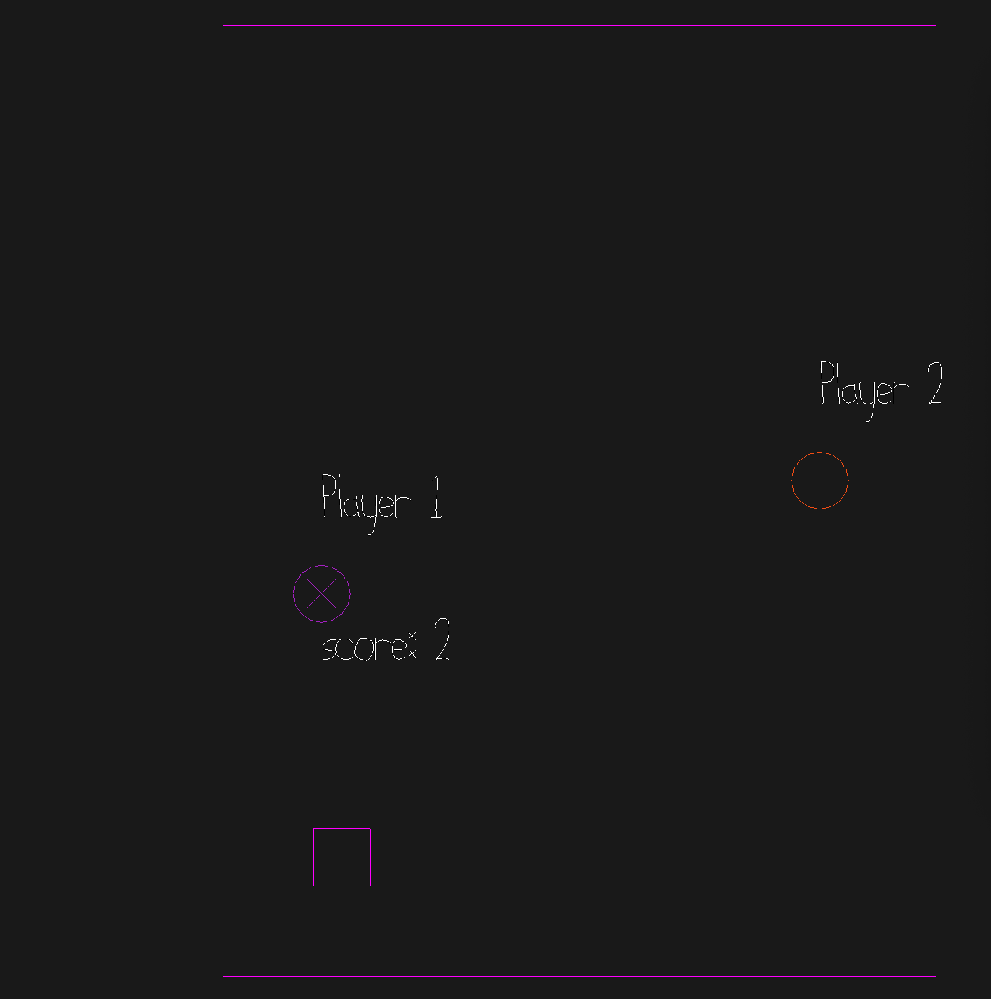

# Catch box

Author: Yilin Wang

Design: Compete with other players to be the first one who catches the box and win scores. 

Networking: The collision detection of the player and the box and the generation of the box index is done in the Game::update loop. Message transmitted between client server is player's position, color, score and the box index it is in the Game::send_state_message.The information is processed in the Game::recv_state_message. 

Screen Shot:

How To Play:

WASD to move

Sources: Build upon the original example multiplayer game in the base 6 source code. 

This game was built with [NEST](NEST.md).

